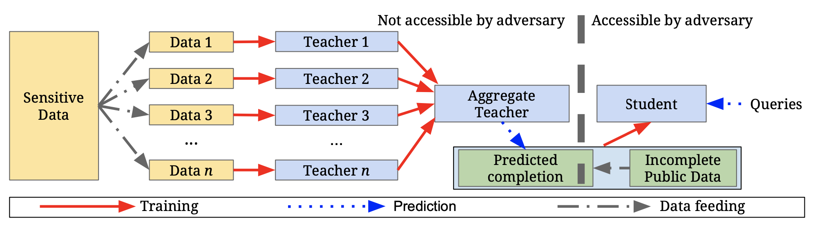
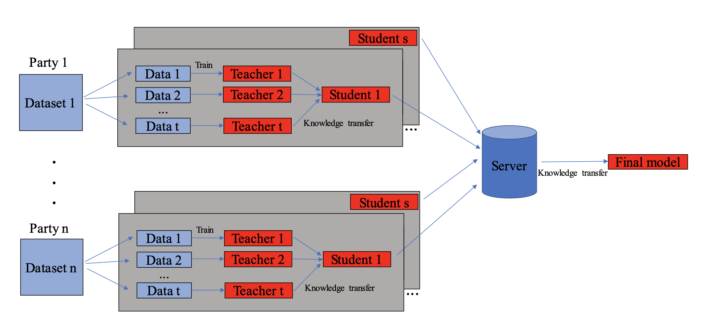
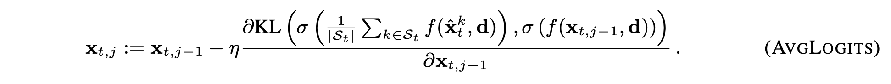
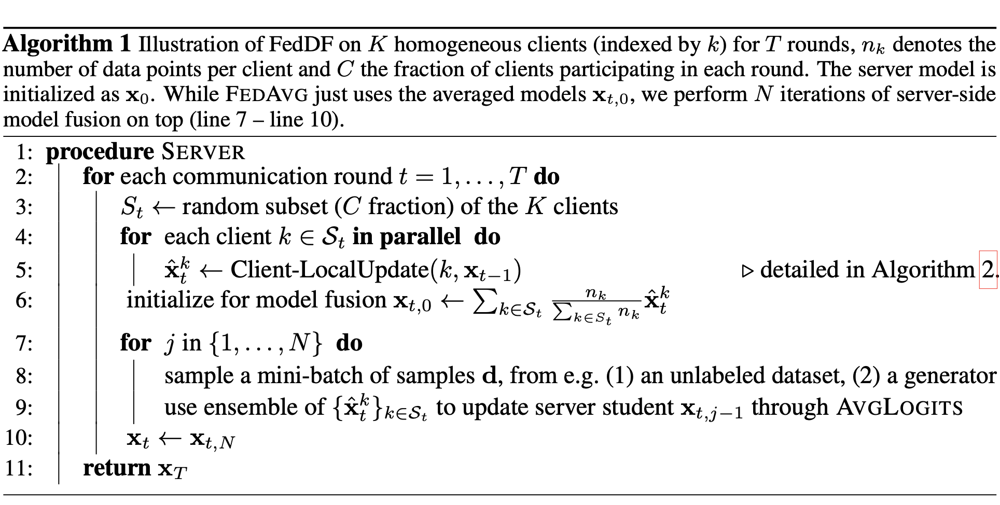
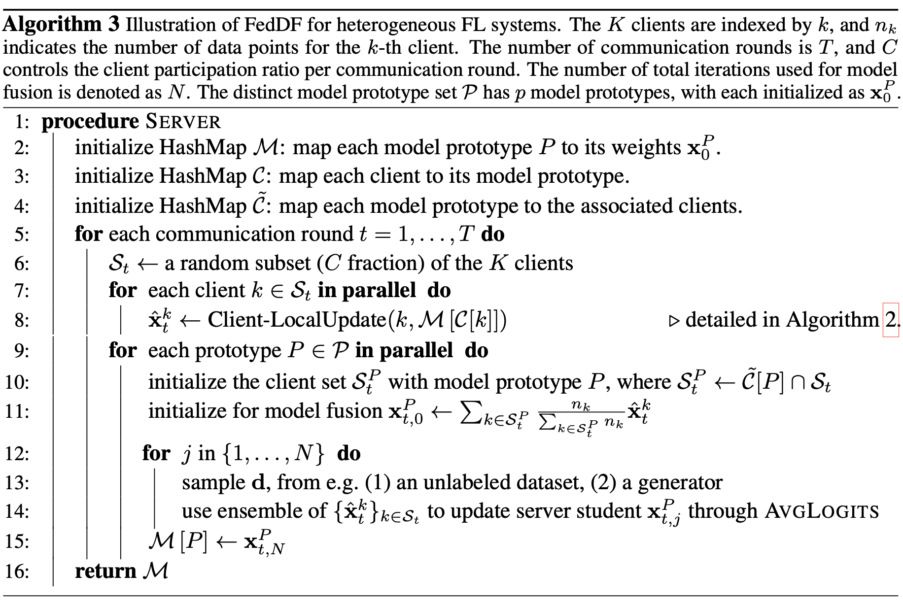
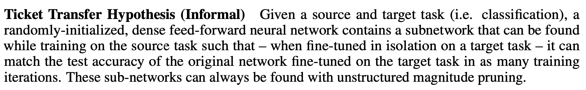

# Other FL methods to adapt

## Model-Agnostic Round-Optimal Federated Learning via Knowledge Transfer

### Related Work:

- Semi-supervised Knowledge Transfer for Deep Learning from Private Training Data

### Problem Domain:

In this paper, the author proposed a FedKT model that is built on the PATE model. This model seeks to do federated learning in a cross-silo setting, where each *silo* is an institution with its private model and computational power. This model takes advantage of the PATE model proposed in *Semi-supervised Knowledge Transfer for Deep Learning from Private Training Data*. PATE model's rough idea is to learn a "Student" model from a "Teacher" model where the Student resides in the server and the Teacher resides in each silo's local machines. 

More specifically, the PATE model can be summarized in the following steps: 
1. Each silo splits the data into several distinct partitions 
2. Each silo trains an independent model on each partition and create a "Teacher" model for each partition 
3. After each silo has trained on the local partitions, the server feeds the Teacher Ensemble a set of unlabeled data and obtains a set of predictions from the Teachers. 
4. The server trains a "Student" model using the Teachers' prediction as labels. 

Building on top of this framework, the FedKT algorithm applies PATE several times for each silo. The server then takes these models and create a Student as the final deployable model.

### Potential Adaptation:  
1. During each communication round, we can iteratively prune each Teacher using the mask learned from the previous communication round, then observe whether masks can perform across different rounds. 
2. We can iteratively prune the student model to see how the masks change after being taught by different teachers

Figure 1: The diagram for the PATE model

Figure 2: The diagram for the FedKT model

## Ensemble Distillation for Robust Model Fusion in Federated Learning

### Problem Domain:

There are two approaches to ensemble learning. First, there's FedAvg where the weights of the models are averaged. However, this can only handle one type of model. Second, there's the Deep Ensemble where the outputs are averaged. However, this requires either the server or the client to remember a large set of models, which can be unrealistic. FedDF proposed in this paper aim to solve both problems. 

The author does this by updating the global server weights using the gradient of KL divergence of each client's model and the server. Referring to the following figure, we can see that the authors first convert the model function to a probability distribution using the sigmoid activation. Then, the algorithm takes the derivative of the KL divergence of the two distributions with respect to the weights in the server. By doing so, the FedDF algorithms can assimilate the learning results from all the clients while considering both the output and the weights.

Figure 3: The AvgLogits aggregation

Figure 4: The homogeneous FedFD algorithm

Figure 5: The heterogeneous FedFD algorithm

### Potential Adaptation:

1. Instead of just using a weighted average like FedAvg, we can use the aggregation method proposed in FedDF

## Sparse Transfer Learning via Winning Lottery Tickets

### Related Work:

- Using Winning Lottery Tickets in Transfer Learning for Convolutional Neural Networks

### Problem Domain:

The author of the paper wants to know if a sub-network pruned using task T can perform equally well when trained afresh on a new task S.

Figure 6: The Ticket Transfer Hypothesis

### Potential Adaptation:

1. Using the union of masks as the aggregation method instead of averaging.
